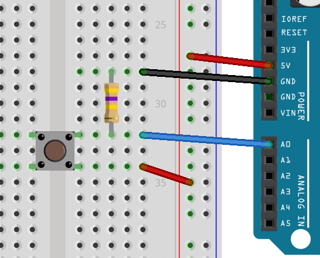

# Buttons

To make interactive things, you need inputs. The most basic of which is a simple push button. This lesson shows you how to add a button, read its value, and react to it. In addition, we're going to learn an important lesson about circuits.

## The code

Firstly, we again start with the modified blink sketch. We will modify the first section:

    int led = A0;
    int button = A1;

We don't really need to modify the `setup()` section, as Arduino sets all pins to `INPUT` by default, but if it didn't we would do this:

    pinMode(led, OUTPUT);
    pinMode(button, INPUT);

Then we will modify `loop()` to react to our button press:

    if( digitalRead(button) )
    {
        digitalWrite(led, HIGH);
    }
    else
    {
        digitalWrite(led, LOW);
    }

`if( ... )` is a keyword that tells the processor that it should do the thing following if the value is not zero, else do the thing in the else. In this case, the `digitalRead` makes the processor set the led to on or off based on the value of the pin `button`.

## Wiring

You now need to wire up your Magnolia so the button is connected to **A1**. To do this, you will need to put your switch on a prototype board, and connect jumper wires from the **VCC** and **A1** to the two legs of the switch.

Buttons with only two pins need to be put in so that the legs are not on the same row (rows are already connected inside the prototyping board). Buttons with four or five pins have connected pairs of legs (five pin buttons have a dead leg that is meant for stability). Find out which pairs of legs are already connected by using the switch in the board and power an LED.

First put the button onto the prototyping board, designate one side of the button **B0** and the other **B1**.

* Make a connection between **VCC** and **B0** (using a jumper from the Magnolia to the row in which **B0** resides.)
* Make a connection between **A1** and **B1** (again using a jumper from the Magnolia to the row in whch **B1** resides.)

## Uploading and seeing something strange

When you upload the program, you will notice that the LED turns on before you touch the button. Sometimes it will flicker on and off a few times, but if you press the button, the LED will stay on constantly. This is because the switch connects the **VCC** to **A1** when the button is pressed, but there is nothing connected to **A1** when the button is not pressed.

In this detached state, reading values from **A1** is very nearly random. Sometimes the voltage goes high just because moving your hand near the button increases the capacitance of the wire. Try playing with it for a bit before we fix the problem.

## Fixing a floating input

Try moving the jumper from **B1**, to **GND**. Doing this makes the LED stay turned off. This is because the input **A1** is getting a strong grounding signal. The grounding signal doesn't have to be very strong, but it has to be there otherwise the wire acts like a kind of aerial or capacitor, picking up stray charge and triggering the **A1** seemingly at random.

When you want a wire to register a high when a button is pressed, you need to connect **B0** to the **VCC**, and **B1** to **A1**, but to make a wire register a low, you also need to connect **A1** to the **GND** so that when the button isn't pressed, the **A1** pin is *dragged down* towards **GND**.

If we connected the output side of the button to **GND** the LED would stay off while the button wasn't pressed, but as soon as we pressed the button, it would short the whole thing out and we may even break stuff.

The solution is to make the **GND** connected to the output side of the button, but in such a way that it doesn't matter if we press the button. We don't have to be strongly grounded, so we can make that connection weaker. To do this, we add a rather high valued resistor. Usually, anything over 2000 Ohms will do, I prefer 470kOhm just to be sure I'm not wasting juice on the *pulldown resistor*.

Wire up the circuit **VCC** to button in, button out to **A1**, but also button out, via *pulldown resistor* to **GND**. Place your resistor on the prototyping board, and like with the button give the two legs names **R0** and **R1**.

* Make a connection between **VCC** and **B0**
* Make a connection between **A1** and **B1**
* Make a connection between **B1** and **R0**
* Make a connection between **R1** and **GND**

Now, when you run the program, the LED does not turn on and off randomly.

## What we need to learn from this

Using switches can cause gaps in your circuits, so you need to make sure you have a circuit all the time, no dangling wires that go no-where. There are two ways to fix dangling wires on switches, the first is to use a `pulldown resistor`, like we did above. Doing this means that at no point is the input pin left unconnectd.

The second method is to use the other input mode of the chip, namely `INPUT_PULLUP`. In this mode things are a bit backward, you will want to connect the switch between the `INPUT_PULLUP` pin, and the **GND**. When the button is pressed, the button will drain causing a change in state for `digitalRead( ... )` on the input pin.

## Fully understanding why it's doing what it's doing

Start by thinking of **A0** as being able to read the voltage difference between **GND** and whatever is plugged into it.

## Finally

Like with the limited resources stopping us from having more LEDs, you'll find that the Magnolia having only 6 IO ports makes having more than 6 buttons a very difficult thing. We can solve this problem too, but that will come in a later lesson about shift-in registers. These convert parallel data into serial data, meaning you can read from 8 inputs at once, using only three pins, just like you did with the shift register for extending the number of outputs.
