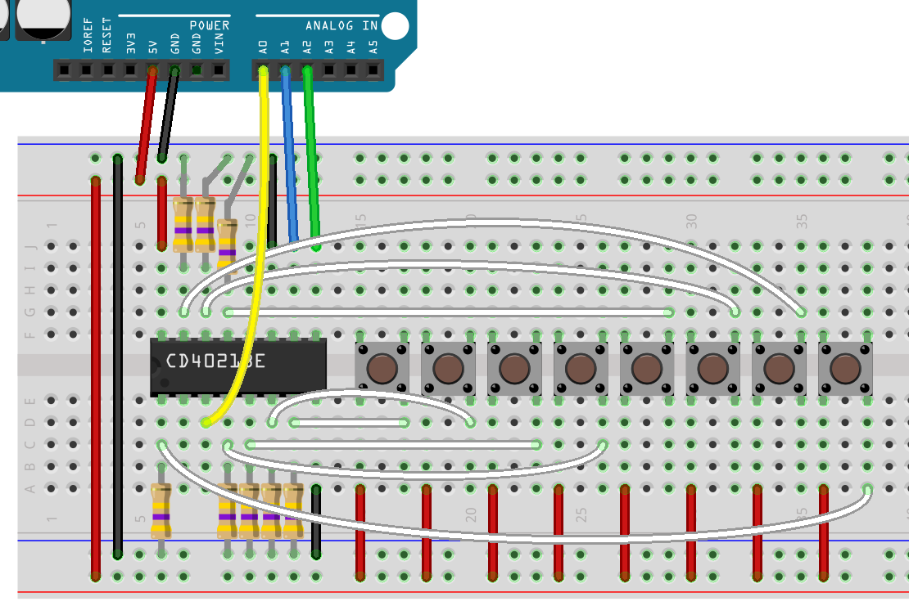

# Multiple Inputs

Shift registers come as input types as well as output types. To get more inputs than six into your Magnolia, whilst reducing the number of pins used to do it, we use a shift-in register, or a parallel to serial convertor. We are going to use a CD4021B, a shift in register

    P8  1   U   16 Vcc
    Q6  2       15 P7
    Q8  3       14 P6
    P4  4       13 P5
    P3  5       12 Q7
    P2  6       11 SER
    P1  7       10 CLK
    GND 8        9 LATCH

The basic function of the shift-in register is the same as the shift register, the master (Magnolia) triggers the serial clock to shift the registers inside the chip. In both these chips, one pin can push data into the chip. In the shift-in register, there are three output pins, but we're not going to use all three, think of them as being convenient optional additions.

In the shift-register, we had a latch pin that when triggered, took the internal registers Q' and put them out to the external registers Q. In the shift-in register, we have internal registers Q, and when we trigger the latch pin 'LATCH', the external registers P overwrite them.

In this way, we can request the input pins are put into the internal buffer (Q), and then read each pin at our leisure (triggering the **CLK** to request the next value.)

## The code

First, we set up which pins we're going to use.

    int Q8 = A0;
    int CLK = A1;
    int LATCH = A2;

    void setup() {
        Serial.begin(9600);
        // SER is input, not output.
        pinMode(Q8, INPUT);
        // both clocks are still output.
        pinMode(CLK, OUTPUT);
        pinMode(LATCH, OUTPUT);
        Serial.println("Starting");
    }

Like the shift-registers, the shift-in registers have a need for a low to high trigger. We can reuse the trigger function from the shift-registers code example.

    void trigger( int pin )
    {
        digitalWrite(pin,HIGH);
        digitalWrite(pin,LOW);
    }

Like the serial output, we have a two stage process, but with input we *get* the values then *read* them.

    int get_pins() {
        trigger(LATCH);
        int value = 0;
        for( int i = 0; i < 8; ++i ) {
            value = value << 1;
            value += get_one();
        }
        return value;
    }

`get_one` is meant to read a single value from the serial registers (the Q values in this chip)

    void get_one( int val ) {
        int value = digitalRead(Q8);
        trigger(CLK);
        return value;
    }

Finally, we will use the value by printing it to the Serial Monitor.

    void loop() {
        int value = get_pins();
        Serial.println(value);
        delay(100);
    }

## Wiring

The wiring is a little less complicated for this chip. Every input needs t be pulled-down, but apart from that, there are less wires to worry about.

* Connect Magnolia **GND** to:
* * **GND** on the CD4021
* * via a pulldown resistor, **P1** through **P8**
* Connect **A0** to **q**
* Connect **A1** to **CLK**
* Connect **A2** to **LATCH**
* Wire up the buttons between **VCC** and **P1** through **P8**

## More inputs

Just as with shift registers, we can chain shift-in registers. As mentioned at the start of this lesson, both chips have serial input, and that means that you can tie **Q8** to **SER** on the next chip down. Make the **SERCLK** common, and the same with **PAR**, and you have all you need to run 16 inputs with the same number of IO pins from the Magnolia.
